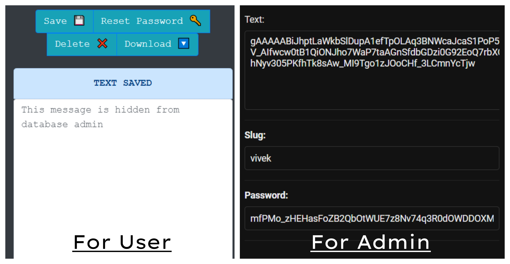

# Text Vault

The Project text vault is an online database where anyone can share text data and encrypt it with a password. Creating a text file in just 2 seconds without any Sign Up and Login.


The unique thing in this web app is that the text is encrypted with SHA256, the text is not in readable for for the DB admin. The text can only be seen with you, the note password is the key to decrypt the note.

Give it a try. [Here](https://textvault.herokuapp.com/)

## Download the Repository

## Virtual Environment

```bash
python -m venv env
```

- ### Activating Virtual Environment

```bash
>> env\Scripts\activate
```

- ### Running Requirement.txt

```bash
(env)>> pip install requirement.txt
```

## Usage

```bash
(env)>> python manage.py runserver
```

## Contributing

Pull requests are welcome. For major changes, please open an issue first to discuss what you would like to change.
